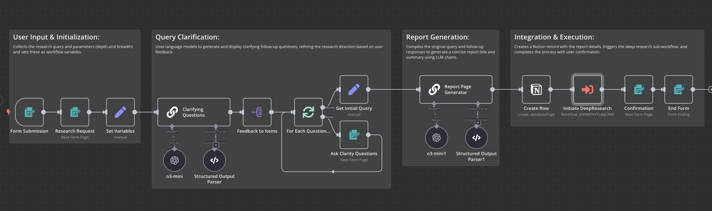
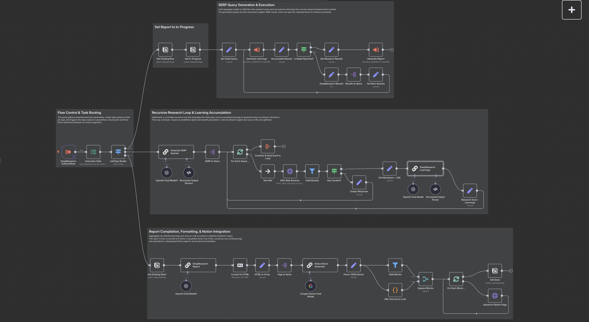

# DeepResearch: Automated Multi-Stage Research Workflow

DeepResearch is an advanced n8n workflow that automates comprehensive research on any topic through recursive exploration, multi-source analysis, and AI-powered synthesis. Inspired by capabilities similar to OpenAI's deep research, this workflow conducts hours of research in minutes.

## Features

- **Recursive Exploration**: Explores topics with adjustable depth and breadth parameters
- **Multi-Stage Approach**: Breaks research into clarifying questions, query generation, and content analysis
- **Web Content Analysis**: Automatically searches, extracts, and analyzes web content
- **AI Synthesis**: Processes information through advanced LLM reasoning to extract meaningful insights
- **Structured Output**: Generates comprehensive reports in Notion with proper formatting
- **Self-Directing**: Identifies and explores relevant sub-topics autonomously

## How It Works

DeepResearch operates in several stages:

1. **Query Clarification**: Generates and asks clarifying questions to refine the research scope
2. **Research Initialization**: Creates a structured record in Notion and prepares the research framework
3. **Recursive Exploration**: For each depth level:
   - Generates diverse search queries based on the research topic
   - Searches and extracts content from multiple sources
   - Analyzes content to extract key learnings
   - Uses learnings to inform the next depth level of research
4. **Report Generation**: Synthesizes all learnings into a comprehensive, structured report
5. **Notion Integration**: Formats and uploads the report with proper styling

## Depth and Breadth Parameters

Control the scope of research with two key parameters:

- **Depth**: Controls how many recursive layers of sub-queries to explore (0-3)
- **Breadth**: Determines how many sources to analyze per query (1-5)

Higher values produce more comprehensive research but increase processing time.

## Example Research

Check out the [examples](examples/) directory for sample research outputs.

## Customization

The workflow can be customized in several ways:

- Modify prompts to change research style and focus
- Add additional data sources
- Customize report formatting
- Integrate with other systems beyond Notion

## Acknowledgements

- **Jim Le** for creating the original workflow design that this project is based on
- n8n for the workflow automation platform
- OpenAI for the LLM capabilities
- APIFY for web content extraction
