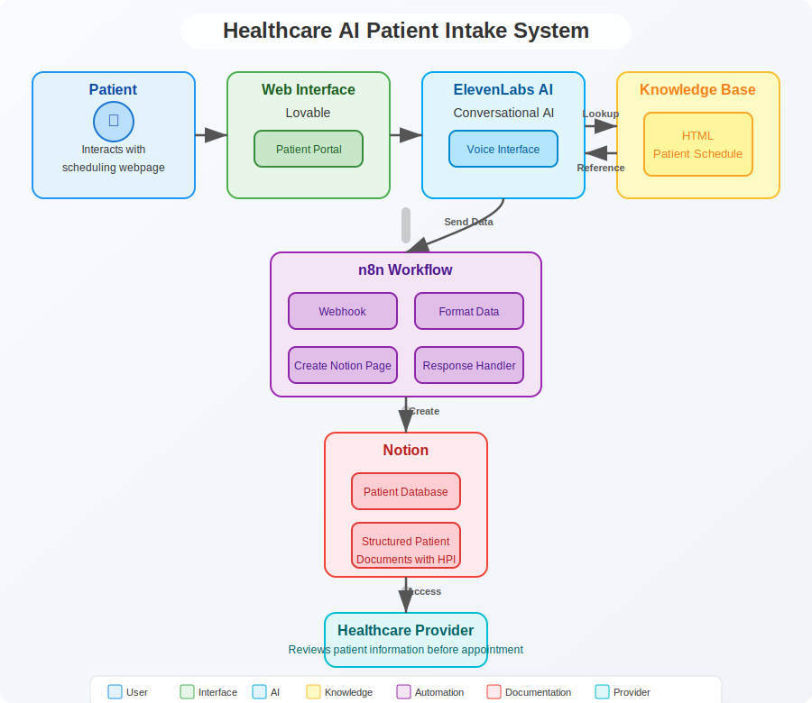
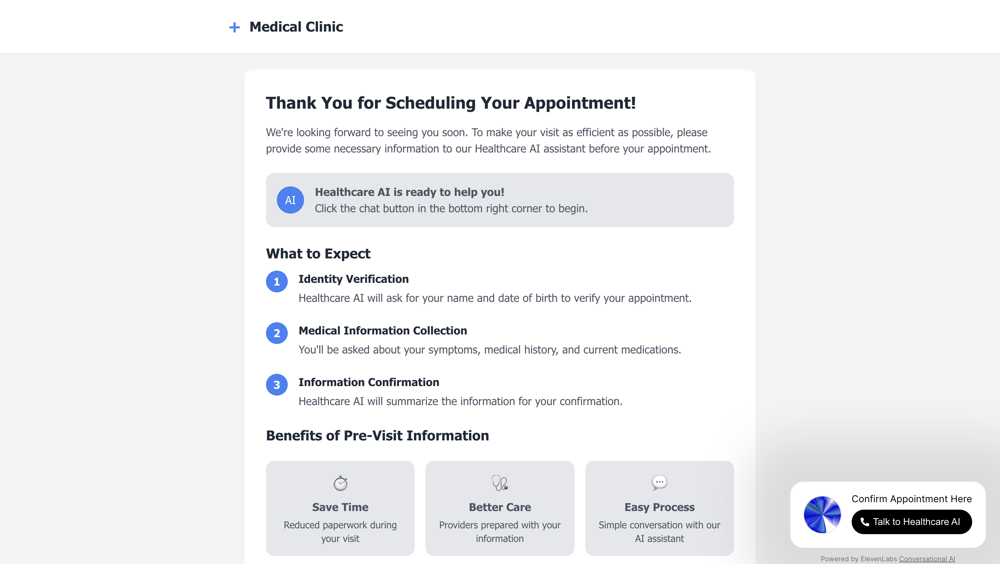
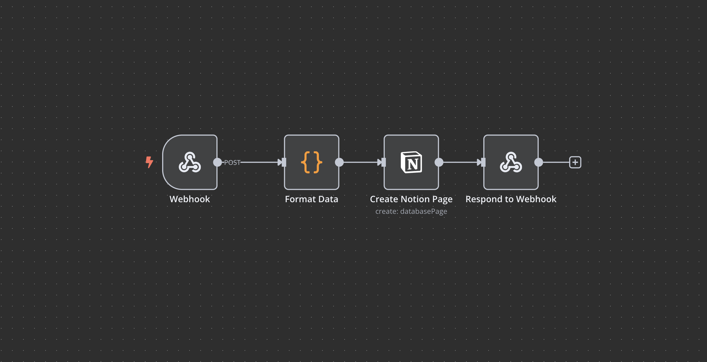

# Healthcare AI Patient Intake Automation

## Overview
This project automates the patient intake process for healthcare clinics using conversational AI. Patients interact with an AI assistant after scheduling their appointment to provide relevant medical information before their appointment, which is then structured into a clinical document in Notion for healthcare providers.

## Technologies Used
- **ElevenLabs**: Conversational AI for patient interaction
- **n8n**: Workflow automation for document creation
- **Notion**: Database for storing structured patient information
- **Lovable**: Web interface design

## Problem & Solution
### Problem
Traditional patient intake processes are time-consuming, error-prone, and often completed in the waiting room, delaying appointments. Providers frequently lack access to structured, up-to-date subjective and objective data from patients before their visit, forcing them to collect this information during the limited appointment time. This reduces clinical efficiency and prevents providers from having a comprehensive understanding of why the patient is seeking care until the encounter has already begun.

### Solution
An AI-powered conversation collects patient information prior to their visit. The system:
1. Verifies patient identity against scheduled appointments
2. Collects medical information through natural conversation
3. Structures data into a clinical document
4. Makes information available to providers before the appointment

## System Architecture

## Web Interface

The patient interaction is handled through a custom web interface built with Lovable. The complete source code for this interface is available in [this repository](https://github.com/gavin98gillespie/healthcare-voice-assistant).

## n8n Workflow

The automation is powered by an n8n workflow that handles the patient data processing and Notion document creation. You can view the workflow [here](n8n-workflow/Healthcare_AI_Notion.json).

## Key Features
- **Appointment Verification**: Confirms patient identity against schedule
- **Structured Data Collection**: Gathers medical history, medications, symptoms
- **Clinical Documentation**: Generates formatted documents with HPI
- **HIPAA Compliance**: Secure handling of patient information can be easily implemented

## Demo
[Link to video demonstration]

## Screenshots
[Include screenshots of each component]

## Setup Instructions
[Detailed setup instructions for each component]

## Future Enhancements
- Integration with EHR systems
- HIPAA Compliance 
- Multi-language support
- Distingishment between new and exisiting patients
