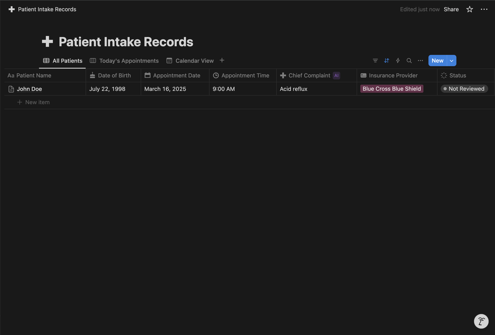
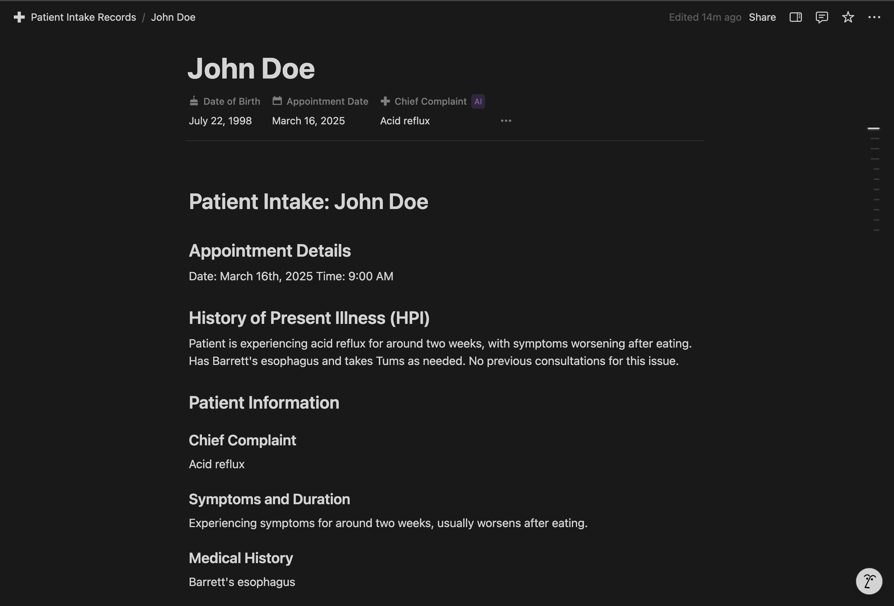
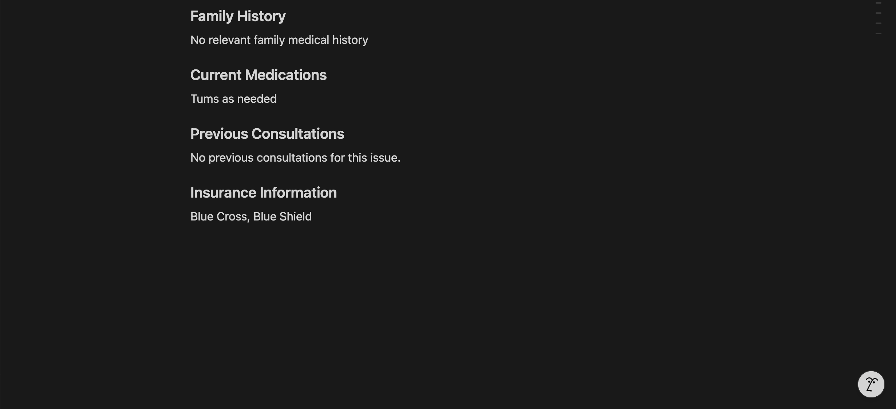

# Healthcare AI Patient Intake Automation

## Overview
This project automates the patient intake process for healthcare clinics using conversational AI. Patients interact with an AI assistant after scheduling their appointment to provide relevant medical information before their appointment, which is then structured into a clinical document in Notion for healthcare providers.

## Technologies Used
- **ElevenLabs**: Conversational AI for patient interaction
- **n8n**: Workflow automation for document creation
- **Notion**: Database for storing structured patient information
- **Lovable**: Web interface design

## Problem & Solution
### Problem
Traditional patient intake processes are time-consuming, error-prone, and often completed in the waiting room, delaying appointments. Providers frequently lack access to structured, up-to-date subjective and objective data from patients before their visit, forcing them to collect this information during the limited appointment time. This reduces clinical efficiency and prevents providers from having a comprehensive understanding of why the patient is seeking care until the encounter has already begun.

### Solution
An AI-powered conversation collects patient information prior to their visit. The system:
1. Verifies patient identity against scheduled appointments
2. Collects medical information through natural conversation
3. Structures data into a clinical document
4. Makes information available to providers before the appointment

## Key Features
- **Appointment Verification**: Confirms patient identity against schedule
- **Structured Data Collection**: Gathers medical history, medications, symptoms, etc..
- **Clinical Documentation**: Generates formatted documents with HPI

## System Architecture

## Web Interface

The patient interaction is handled through a custom web interface built with Lovable. This is just for demonstration purposes. 

## n8n Workflow

The automation is powered by an n8n workflow that handles the patient data processing and Notion document creation. 

## Notion Integration

The Healthcare AI Assistant automation stores all patient intake information in a structured Notion database, creating an organized system for healthcare providers to access patient information prior to appointments.

### Patient Database

The system automatically creates structured patient records in Notion, organizing key information in a database format for easy access:

### Individual Patient Records

Each patient interaction generates a detailed document containing the complete intake information, including chief complaint, symptoms, medical history, and automatically generated HPI:

### Key Features

- **Automated Documentation:** Patient information flows directly from the conversation to structured documents
- **Standardized Format:** All patient records follow the same professional format
- **HPI Generation:** The system automatically creates a clinical History of Present Illness summary
- **Searchable Database:** Providers can easily find and review patient information
- **Status Tracking:** Each record includes a status field to track review progress

## Demo
[Link to video demonstration] [Demo](https://drive.google.com/file/d/1ot1feFSOSPasFI-6EvViXFHKmNJSfDxB/view?usp=sharing)

## Future Enhancements
- Integration with EHR systems
- Integration with secure and HIPAA compliant data collection and storage systems
- Multi-language support
- Distingishment between new and exisiting patients
