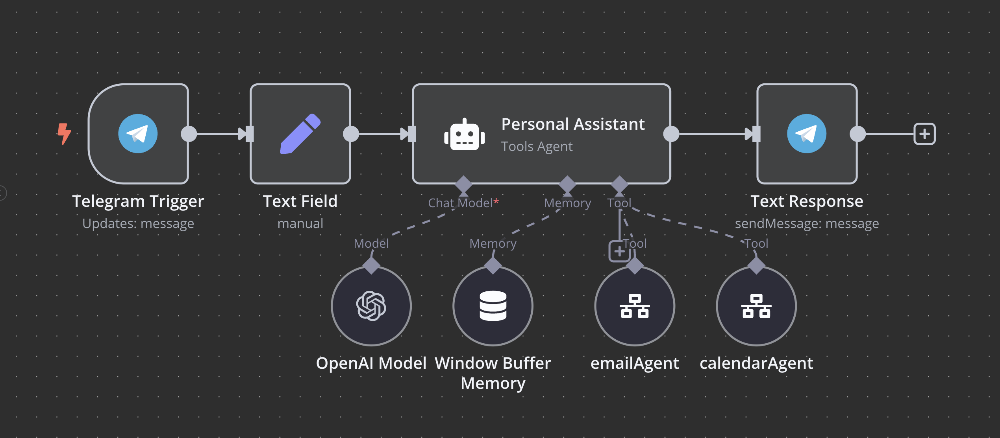

# Personal AI Assistant

A powerful Telegram-based AI assistant that manages your email, calendar, and conducts deep research through specialized AI agents built on n8n.

## System Overview

This Personal Assistant is an intelligent Telegram bot that routes user requests to specialized AI agents for different tasks:

- **Email Management**: Draft, send, and organize emails through Gmail
- **Calendar Management**: Schedule, update, and manage calendar events
- **Deep Research**: Conduct comprehensive research on complex topics

The system uses advanced AI to understand natural language requests and route them to the appropriate specialized tool.

## Architecture

The system consists of these integrated components:

### 1. Core Personal Assistant
- **Telegram Interface**: Processes user messages from Telegram
- **Request Router**: Analyzes requests and forwards them to specialized agents
- **Memory System**: Maintains conversation context with window buffer memory

### 2. Email Agent
- Sends emails and creates drafts
- Retrieves and organizes emails
- Manages email labels and read/unread status

### 3. Calendar Agent
- Creates calendar events (with or without attendees)
- Fetches schedule information
- Updates and deletes events

### 4. Deep Research Agent
- Redirects complex research requests to a form-based system
- Conducts in-depth research across multiple sources
- Generates comprehensive reports in Notion

## Usage Guide

### Email Commands
Send messages like:
- "Draft an email to john@example.com about our meeting tomorrow"
- "Send an email to the team about the project deadline"
- "Check my unread emails from yesterday"
- "Label the last email from Sarah as important"

### Calendar Commands
Send messages like:
- "Schedule a meeting with Alex tomorrow at 2pm"
- "What's on my calendar for next Monday?"
- "Move my dentist appointment to Friday afternoon"
- "Cancel my 3pm meeting today"

### Research Commands
Send messages like:
- "Research the impact of AI on healthcare in rural communities"
- "I need a comprehensive analysis of renewable energy trends in Europe"

When using research commands, the assistant will provide a link to a form where you can specify research parameters.

## Technical Details

- **AI Models**: Uses OpenAI's o3-mini for intelligent request routing
- **Conversation Memory**: Window buffer memory maintains context between messages
- **Webhook Integration**: Telegram webhooks process incoming messages
- **Tool-based Architecture**: AI agent delegates to specialized tools rather than trying to handle all tasks directly

---

*Note: This README provides an overview of the workflow. For more detailed documentation on specific components, please refer to the documentation for each sub-workflow.*
