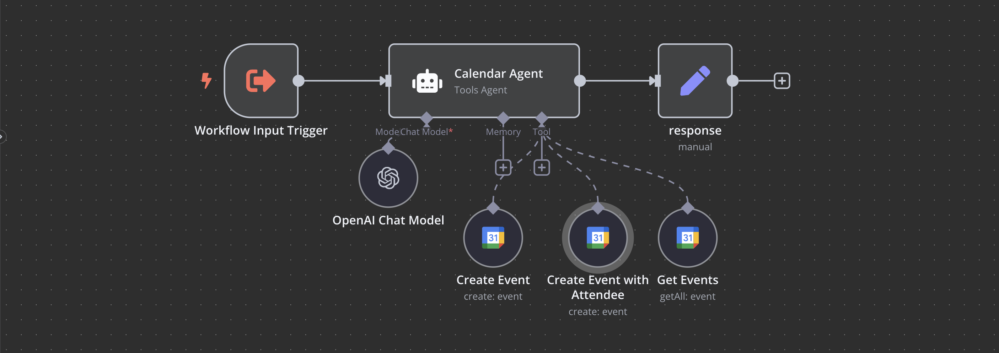

# Email Agent

A specialized n8n workflow that provides AI-powered email management capabilities through Gmail integration.

## Overview

The Email Agent is a subworkflow of the Personal AI Assistant system that handles all email-related tasks. It leverages OpenAI's GPT models to understand natural language requests and execute email operations through Gmail.


## Features

- **Send Emails**: Compose and send professional emails through Gmail
- **Create Drafts**: Save email drafts for later editing and sending
- **Retrieve Emails**: Fetch emails based on various criteria
- **Manage Labels**: Get label information and apply labels to emails
- **Message Management**: Mark emails as unread, reply to emails, and more
- **Professional Formatting**: All emails are formatted professionally and signed as "Nate"

## Technical Architecture

The workflow consists of these key components:

1. **Input Handler**: Accepts queries from the parent Personal Assistant workflow
2. **AI Agent**: Processes natural language requests using OpenAI GPT-4o
3. **Email Tools**: Multiple specialized nodes for different Gmail operations
4. **Response Handler**: Returns results or error messages to the parent workflow

## Usage Examples

The agent can handle natural language requests like:

```
"Draft an email to john@example.com about the project update"
"Send an email to the marketing team about tomorrow's meeting"
"Get my unread emails from yesterday"
"Label all emails from Sarah as 'Important'"
"Reply to the last email from the client"
```

## Technical Details

- **Model**: Uses OpenAI GPT-4o for natural language understanding
- **Error Handling**: Provides graceful fallbacks when operations fail
- **Authentication**: Uses OAuth2 for secure Gmail access
- **HTML Support**: Emails can be formatted with HTML for professional appearance

-------------------------

# Calendar Agent

A specialized n8n workflow that provides AI-powered calendar management capabilities through Google Calendar integration.

## Overview

The Calendar Agent is a subworkflow of the Personal AI Assistant system that handles all calendar-related tasks. It leverages OpenAI's GPT models to understand natural language requests and execute calendar operations.



## Features

- **Create Events**: Schedule new calendar events with or without attendees
- **Retrieve Schedule**: Get calendar events for specific time periods
- **Manage Events**: Update or delete existing calendar events
- **Smart Defaults**: Automatically handles missing information (e.g., assumes 1-hour duration when not specified)

## Technical Architecture

The workflow consists of these key components:

1. **Input Handler**: Accepts queries from the parent Personal Assistant workflow
2. **AI Agent**: Processes natural language requests using OpenAI GPT-4o
3. **Calendar Tools**: Multiple specialized nodes for different Google Calendar operations
4. **Response Handler**: Returns results or error messages to the parent workflow

## Usage Examples

The agent can handle natural language requests like:

```
"Schedule a team meeting tomorrow at 2pm"
"What's on my calendar for next Friday?"
"Cancel my dentist appointment"
"Reschedule my 3pm meeting to 4pm"
"Add John (john@example.com) to my product review meeting"
```

## Technical Details

- **Model**: Uses OpenAI GPT-4o for natural language understanding
- **Error Handling**: Provides graceful fallbacks when operations fail
- **Authentication**: Uses OAuth2 for secure Google Calendar access
- **Time Management**: Intelligently handles date and time specifications

---

*Note: Both agents are designed to be used as subworkflows of the Personal AI Assistant system, not as standalone applications.*
