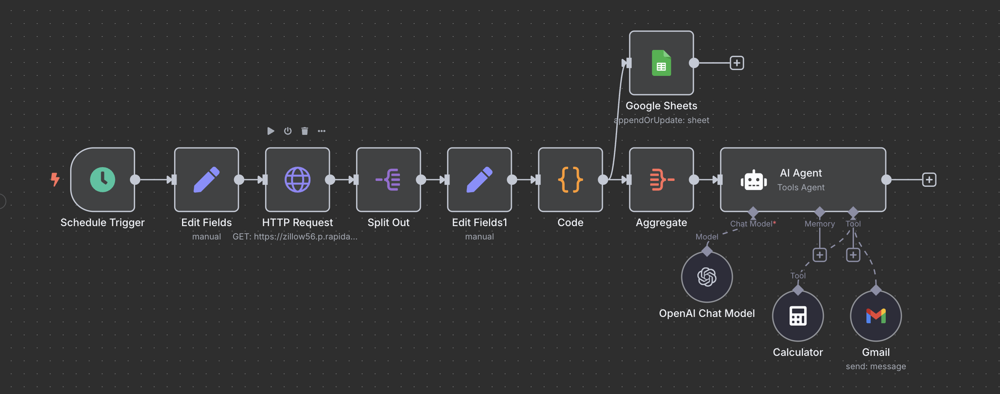

# Real Estate AI Agent

An automated workflow that analyzes real estate listings, calculates investment metrics, and sends daily reports via email to help investors make data-driven decisions.

## Overview

This n8n workflow serves as a real estate investment analysis tool that:

1. Fetches property listings from Zillow based on configurable search criteria
2. Calculates key investment metrics:
   - Cash on Cash Return (ROI)
   - Cap Rate
   - Monthly/Annual Cash Flow
   - Price Per Square Foot
   - And more...
3. Stores and updates the data in a Google Sheet for historical tracking
4. Generates a daily AI-powered report highlighting the best investment opportunities
5. Emails the report automatically to your inbox every morning

## Features

- **Automated Property Search**: Configure location, price range, bedrooms, and more
- **Investment Metric Calculations**: Down payment, mortgage payments, cash flow, ROI, etc.
- **AI-Powered Analysis**: Summarizes findings and recommends properties
- **Daily Email Reports**: Receive the top properties by ROI and Cap Rate each morning
- **Google Sheets Integration**: All data is stored for historical tracking and analysis

## Output

The workflow generates two main outputs:

1. **Google Sheet**: A comprehensive spreadsheet with all properties and their calculated metrics
2. **Daily Email Report**: Contains:
   - Market sentiment summary
   - Top 3 properties by Cash on Cash ROI
   - Top 3 properties by Cap Rate
   - Negative cash flow alerts
   - Portfolio averages
   - Investment recommendations
